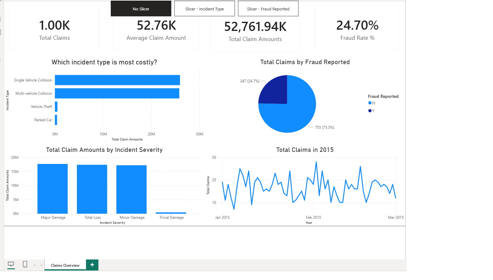

# 📊 Insurance Claims Analysis Dashboard (Power BI)

## 📌 Project Overview
This project analyzes insurance claims data to identify high-risk incident types, claim severity patterns, and fraud distribution. An interactive Power BI dashboard was built to help stakeholders quickly understand claim behavior and support data-driven decision-making.

---

## 🎯 Objectives
- Analyze total and average insurance claim amounts  
- Identify the most costly incident types  
- Compare claim amounts across different severity levels  
- Analyze fraud vs non-fraud claims  
- Understand claim trends and distribution using interactive filters  

---

## 🛠 Tools & Technologies
- **Power BI**
- **Power Query** (Data Cleaning & Transformation)
- **DAX** (Measures & KPIs)

---

## 📈 Key Metrics (KPIs)
- Total Claims  
- Total Claim Amount  
- Average Claim Amount  
- Fraud Rate (%)  

---

## 📊 Dashboard Features
- **Incident Type Analysis** – identifies the most costly incident types  
- **Incident Severity Analysis** – compares total claim amounts by severity  
- **Fraud Analysis** – visualizes fraud vs non-fraud claims  
- **Claims Trend Analysis** – shows claim distribution within the year  
- **Interactive Slicers** to filter the dashboard by:
  - Incident Type  
  - State  
  - Fraud Reported  

---

## 🖼 Dashboard Preview

---

## 📂 Files Included
- `Insurance_Claims_Dashboard.pbix` – Power BI dashboard file  
- `Insurance_Claims.png` – Dashboard screenshot  
- `README.md` – Project documentation  

---

## 📌 Key Insights
- Certain incident types contribute significantly higher claim amounts  
- Major damage incidents result in the highest total claims  
- Fraud cases form a notable percentage of overall claims  
- Claim distribution varies across states and incident severity levels  

---

## 📎 Conclusion
This dashboard provides a clear and interactive overview of insurance claims and fraud patterns. It can help insurance analysts and risk teams identify cost drivers, assess risk exposure, and support informed decision-making.

---

## 👤 Author
**Yashvi Jain**  
